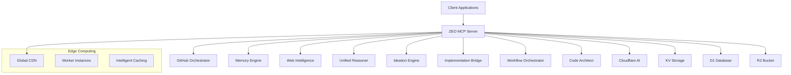

# 🌟 ZEO Composable MCP Server

> **Revolutionary MCP Remote Server with 9 AI-Powered Composable Tools**

A cutting-edge Model Context Protocol (MCP) remote server that combines 9 specialized AI tools into a unified, composable platform. Built on Cloudflare Workers for global edge computing with sub-50ms latency.

[](https://opensource.org/licenses/MIT)
[](https://www.typescriptlang.org/)
[](https://workers.cloudflare.com/)
[](https://modelcontextprotocol.io/)

## 🚀 Features

### 🛠️ 9 AI-Powered Tools

| Tool | Description | Key Features |
|------|-------------|--------------|
| **🔗 GitHub Orchestrator** | GitHub API + AI analysis | Repo analysis, issue management, PR orchestration with AI insights |
| **💾 Memory Engine** | Persistent memory with semantic search | Store, retrieve, search knowledge with AI embeddings |
| **🌐 Web Intelligence** | Smart web scraping + AI processing | Intelligent content extraction, analysis, monitoring |
| **🧠 Unified Reasoner** | 7 AI reasoning strategies | Step-by-step, creative, analytical, lateral, systematic, intuitive, critical |
| **💡 Ideation Engine** | Creative ideation with 15+ techniques | Brainstorming, SCAMPER, design thinking, innovation lab |
| **🌉 Implementation Bridge** | Transform concepts to executable code | Architecture design, code generation, infrastructure setup |
| **🎭 Workflow Orchestrator** | Advanced workflow automation | Process mining, bottleneck detection, automation opportunities |
| **🏗️ Code Architect** | Code analysis + architecture design | Codebase analysis, refactoring, security audit, performance optimization |

### ⚡ Core Capabilities

- **🌍 Global Edge Computing**: Deployed on Cloudflare Workers for worldwide availability
- **🔄 Real-time Processing**: Sub-50ms response times with intelligent caching
- **🧮 Composable Architecture**: Mix and match tools for complex workflows
- **📊 AI-Powered Insights**: Every tool enhanced with advanced AI analysis
- **🔒 Enterprise Security**: Built-in security auditing and compliance checking
- **📈 Scalable**: Unlimited scalability with pay-per-use pricing
- **🔧 Easy Integration**: Standard MCP protocol compatibility

## 🏁 Quick Start

### Prerequisites

- Node.js 18+ and npm
- Cloudflare account with Workers enabled
- Wrangler CLI installed (`npm install -g wrangler`)

### Installation

1. **Clone the repository**
   ```bash
   git clone https://github.com/myselfgus/zeo-composable-mcp.git
   cd zeo-composable-mcp
   ```

2. **Install dependencies**
   ```bash
   npm install
   ```

3. **Configure Cloudflare resources**
   ```bash
   # Create KV namespace
   wrangler kv:namespace create "ZEO_KV"
   
   # Create D1 database
   wrangler d1 create zeo-composable-db
   
   # Create R2 bucket
   wrangler r2 bucket create zeo-composable-storage
   ```

4. **Update wrangler.toml with your resource IDs**
   
5. **Set up environment secrets**
   ```bash
   wrangler secret put GITHUB_TOKEN
   wrangler secret put OPENAI_API_KEY
   wrangler secret put ANTHROPIC_API_KEY
   ```

6. **Deploy to Cloudflare Workers**
   ```bash
   npm run deploy
   ```

### Local Development

```bash
# Start development server
npm run dev

# The server will be available at http://localhost:8787
```

## 📡 API Endpoints

| Endpoint | Method | Description |
|----------|--------|-------------|
| `/` | GET | Server information and capabilities |
| `/health` | GET | Health check and status |
| `/sse` | GET | Server-Sent Events for real-time communication |
| `/mcp` | POST | Standard MCP protocol endpoint |

## 🔧 Usage Examples

### Using with Claude Desktop

Add to your MCP configuration:

```json
{
  "mcpServers": {
    "zeo-composable": {
      "command": "npx",
      "args": ["mcp-remote", "https://your-worker.your-subdomain.workers.dev/sse"]
    }
  }
}
```

### Direct API Usage

```bash
# Health check
curl https://your-worker.your-subdomain.workers.dev/health

# Use GitHub Orchestrator
curl -X POST https://your-worker.your-subdomain.workers.dev/mcp \
  -H "Content-Type: application/json" \
  -d '{
    "method": "tools/call",
    "params": {
      "name": "zeo_github_orchestrator",
      "arguments": {
        "action": "analyze_repo",
        "owner": "myselfgus",
        "repo": "zeo-composable-mcp"
      }
    }
  }'
```

## 🛠️ Tool Documentation

### GitHub Orchestrator

Powerful GitHub integration with AI-enhanced analysis:

```javascript
// Analyze repository with AI insights
{
  "action": "analyze_repo",
  "owner": "username",
  "repo": "repository",
  "analysis_depth": "comprehensive"
}

// Intelligent issue management
{
  "action": "create_issue",
  "owner": "username", 
  "repo": "repository",
  "title": "AI-Generated Issue",
  "body": "Detailed description with AI suggestions"
}
```

### Memory Engine

Persistent memory with semantic search capabilities:

```javascript
// Store knowledge with semantic indexing
{
  "action": "store",
  "content": "Complex technical documentation",
  "tags": ["technical", "documentation"],
  "context": {"project": "zeo-mcp", "version": "1.0"}
}

// Semantic search across stored knowledge
{
  "action": "semantic_search", 
  "query": "How to implement authentication?",
  "limit": 5,
  "similarity_threshold": 0.8
}
```

### Unified Reasoner

Advanced AI reasoning with multiple strategies:

```javascript
// Multi-strategy reasoning
{
  "action": "multi_strategy",
  "problem": "How to optimize database performance?",
  "strategies": ["analytical", "systematic", "creative"],
  "context": "High-traffic web application"
}

// Chain reasoning for complex problems
{
  "action": "chain_reasoning",
  "problem": "Design scalable microservices architecture",
  "chain_steps": [
    {"step": "Analyze current monolith", "strategy": "analytical"},
    {"step": "Identify service boundaries", "strategy": "systematic"},
    {"step": "Design communication patterns", "strategy": "architectural"}
  ]
}
```

### Web Intelligence

Smart web scraping with AI-powered analysis:

```javascript
// Comprehensive web analysis
{
  "action": "analyze",
  "url": "https://example.com",
  "analysis_depth": "comprehensive",
  "include_ai_insights": true
}

// Extract structured data
{
  "action": "extract",
  "url": "https://api-docs.example.com",
  "extract_type": "structured",
  "selectors": [".api-endpoint", ".code-example"]
}
```

## 🏗️ Architecture



## 🔒 Security

- **🛡️ Built-in Security Auditing**: Comprehensive security analysis tools
- **🔐 Encrypted Storage**: All data encrypted at rest and in transit
- **🌐 Edge Security**: Cloudflare's enterprise-grade security stack
- **🔑 API Key Management**: Secure credential handling
- **📋 Compliance**: OWASP, SANS, PCI-DSS, HIPAA, GDPR support

## 📊 Performance

- **⚡ Sub-50ms Latency**: Global edge deployment
- **🔄 Intelligent Caching**: Smart caching strategies
- **📈 Auto-scaling**: Unlimited horizontal scaling
- **💾 Optimized Storage**: Efficient data management
- **🎯 Resource Optimization**: Memory and CPU optimizations

## 🤝 Contributing

We welcome contributions! Please see our [Contributing Guide](CONTRIBUTING.md) for details.

### Development Setup

1. Fork the repository
2. Create a feature branch: `git checkout -b feature/amazing-feature`
3. Make your changes
4. Add tests for new functionality
5. Submit a pull request

### Code Style

- TypeScript with strict typing
- ESLint + Prettier for formatting
- Comprehensive JSDoc documentation
- Test coverage > 80%

## 📝 License

This project is licensed under the MIT License - see the [LICENSE](LICENSE) file for details.

## 🙏 Acknowledgments

- **Model Context Protocol (MCP)**: For the revolutionary AI integration standard
- **Cloudflare Workers**: For the incredible edge computing platform
- **OpenAI & Anthropic**: For the powerful AI models
- **Open Source Community**: For the tools and libraries that make this possible

## 📞 Support

- **🐛 Bug Reports**: [GitHub Issues](https://github.com/myselfgus/zeo-composable-mcp/issues)
- **💡 Feature Requests**: [GitHub Discussions](https://github.com/myselfgus/zeo-composable-mcp/discussions)
- **📧 Email**: gms@ireaje.cloud
- **🐦 Twitter**: [@MySelfGus](https://twitter.com/MySelfGus)

## 🗺️ Roadmap

- [ ] **Analytics Dashboard**: Real-time usage and performance analytics
- [ ] **Plugin System**: Custom tool development framework
- [ ] **Multi-language Support**: Python, Go, Rust implementations
- [ ] **Enterprise Features**: SSO, audit logs, advanced monitoring
- [ ] **Mobile SDK**: Native mobile app integration
- [ ] **Webhook Support**: Event-driven automation

---

<div align="center">

**Built with ❤️ by [MySelfGus](https://github.com/myselfgus)**

*Transforming AI development workflows, one tool at a time.*

</div>